# Counting kmers for sequencing quality awareness

## Instance 
This lesson downloads a handful of datasets onto a cloud instance, counts
long (k=21) kmers in them, and compares kmer spectra before and after some bioinformatic 
filters.

A programming exercise / kmer interpretation
puzzle, can be found in another ngs-docs lesson at 
http://angus.readthedocs.org/en/2016/automation.html

## Set up Amazon instance and install dependencies

Launch an *m3-xlarge* instance on Amazon EC2 using the *Ubuntu 14.04 server* image.

Hints on starting an instance can be found here:
https://github.com/datacarpentry/cloud-genomics/blob/gh-pages/lessons/1.logging-onto-cloud.md

### ssh config 
since the ssh command line is a little much:
```bash
ssh -i "ec2key.pem" ubuntu@ec2-54-159-128-110.compute-1.amazonaws.com
```
On mac and linux you can add four lines to `~/.ssh/config` to associate a nickname to your instance, provide the username automatically, and locate the key file without additional effort:
```
Host ec2
Hostname ec2-54-159-128-110.compute-1.amazonaws.com
User ubuntu
IdentityFile /Users/wltrimbl/Downloads/ec2key.pem
```
This makes it possible to ssh into your newly created instance with comparatively little typing:
```bash
ssh ec2
```
and, even better, you can do one-line command-line transfers of files to / from your local machine and remote machines:
```bash
# Copy local file to remote machine on the command line
scp localfile ec2:/path/to/remotefile
# Copy remote file to local 
scp ec2:/path/to/remotefile localfilename
```

## Installing the tools

First, we will need all the ubuntu packages the below tools depend on.
```bash
sudo apt-get update
```
and then
```
sudo apt-get install -y python-pip python-dev git python-matplotlib python-scipy jellyfish default-jre unzip
```

We first install [SRAtools](https://github.com/ncbi/sra-tools/wiki/Downloads):  (we will use this to get / convert format of sequence data from SRA)
```
wget http://ftp-trace.ncbi.nlm.nih.gov/sra/sdk/2.5.7/sratoolkit.2.5.7-ubuntu64.tar.gz
tar xvf sratoolkit.2.5.7-ubuntu64.tar.gz
```

Then [khmer](http://khmer.readthedocs.org/en/v2.0/) : (we will use this to count kmers)
```bash
#sudo apt-get update
#sudo apt-get install -y python-pip python-dev  
sudo easy_install -U setuptools
sudo pip install khmer
```

And [kmerspectrumanalyzer](http://github.com/wltrimbl/kmerspectrumanlyzer) + [jellyfish](http://www.cbcb.umd.edu/software/jellyfish/)  (yet another kmer counter + kmer count visualization)
```bash
#sudo apt-get install -y git python-matplotlib python-scipy jellyfish
cd && git clone http://github.com/wltrimbl/kmerspectrumanalyzer
```

And we also need to clone the [khmer](http://github.com/dib-lab/khmer) repository:
```bash
cd && git clone http://github.com/dib-lab/khmer
```

And install [Trimmomatic](http://www.usadellab.org/cms/index.php?page=trimmomatic)
```bash
#sudo apt-get install -y default-jre unzip
cd && wget http://www.usadellab.org/cms/uploads/supplementary/Trimmomatic/Trimmomatic-0.35.zip
unzip Trimmomatic-0.35.zip
```

and finally, we configure our PATH for the parts of the tools
```bash
echo 'PATH=$PATH:$HOME/khmer/sandbox' >> ~/.bashrc
echo 'PATH=$PATH:$HOME/kmerspectrumanalyzer/src' >> ~/.bashrc
echo 'PATH=$PATH:$HOME/sratoolkit.2.5.7-ubuntu64/bin' >> ~/.bashrc
echo 'trimmomatic=$HOME/Trimmomatic-0.35/trimmomatic-0.35.jar' >> ~/.bashrc
source ~/.bashrc
```

### Check toolkit for completeness

Let us test the kit.
```bash
fastq-dump --help && echo OK
error-correct-pass2.py --help && echo OK 
countkmer21.sh  && echo OK
java -jar $trimmomatic --help && echo OK
touch /mnt/littlebunnyfoofoo && echo OK
```

If we can't create a file in /mnt we aren't going to get very far, so 
change permissions on /mnt

```bash
sudo chown ubuntu /mnt
```

## Downloading sequence data
Now the tools are in place, it is time some some sequence data and do something with it.

I'd like to draw your attention to three datasets in SRA.: 
* [SRR519926](http://www.ncbi.nlm.nih.gov/sra/?term=SRR519926)
* [SRR036919](http://www.ncbi.nlm.nih.gov/sra/?term=SRR036919) and 
* [SRR447649](http://www.ncbi.nlm.nih.gov/sra/?term=SRR447649) 

Two of these are E. coli shotgun  and is PhiX, illumina's favorite calibration sequence.

```bash
cd /mnt
wget ftp://ftp-trace.ncbi.nih.gov/sra/sra-instant/reads/ByRun/sra/SRR/SRR519/SRR519926/SRR519926.sra #   86M
wget ftp://ftp-trace.ncbi.nih.gov/sra/sra-instant/reads/ByRun/sra/SRR/SRR036/SRR036919/SRR036919.sra #  196M 
wget ftp://ftp-trace.ncbi.nih.gov/sra/sra-instant/reads/ByRun/sra/SRR/SRR447/SRR447649/SRR447649.sra #  168M
fastq-dump --split-3 SRR519926.sra 
fastq-dump --split-spot SRR519926.sra
fastq-dump --split-3 SRR036919.sra 

# This step creates SRR447649_1.fastq and SRR447649_2.fastq
fastq-dump --split-3 SRR447649.sra 
# This puts the same data into a single file SRR447649.fastq
fastq-dump --split-spot SRR447649.sra 
```
This downloads three smallish datasets from SRA in SRA's format, and uncompresses them into one or two files, depending on whether the sequencing run produced paired reads or not.

We get output like
```
Rejected 1373828 READS because of filtering out non-biological READS
Read 1373828 spots for SRR447649.sra
Written 1373828 spots for SRR447649.sra
```
This procedure gives us 7 FASTQ files.  We should look at them.

```
head -n 8 SRR447649.fastq   # Escherichia coli str. K-12 substr. MG1655 from Broad  2x101bp
head -n 8 SRR036919.fastq   # Phix calibration lane from Berkeley 1x45bp
head -n 8 SRR519926.fastq   # Escherichia coli str. K-12 substr. MG1655 on Miseq from Broad 2  2x251bp
```

## Counting kmers

Like anything in bioinformatics, there are many algorithmic and software options to count kmers.  QP Zhang wrote an [evaluation](http://journals.plos.org/plosone/article?id=10.1371/journal.pone.0101271) in 2014.  Easy problems, like counting tetramers (256) and hexamers (4096) can be done in obvious ways.  Harder problems like counting long kmers in diverse datasets with memory less than the sequence diversity weed out some algorithms and make memory efficiency relevant.

We show off two kmer-counting tools here: khmer and jellyfish.  For our purposes, they do the same thing.

First, we will count the kmers in these datasets using khmer.   This is a two-step process, we first parse the data and populate a kmer bloom filter: 
```bash
load-into-counting.py -x 1e9 -k 21 SRR447649.4G.kh SRR447649_1.fastq SRR447649_2.fastq 
```
This produces SRR447649.4G.kh using the sequence data in SRR447649_1.fastq and SRR447649_2.fastq.
```
Saving k-mer countgraph to SRR447649.4G.kh
Loading kmers from sequences in ['SRR447649_1.fastq', 'SRR447649_2.fastq']
making countgraph
consuming input SRR447649_1.fastq
consuming input SRR447649_2.fastq
Total number of unique k-mers: 43156383
saving SRR447649.4G.kh
```
Next parse the dataset a second time to look up the final count of each kmer with abundance-dist.py:  
```bash
abundance-dist.py -s SRR447649.4G.kh  SRR447649.fastq SRR447649.4G.21
```
This command uses the sequences in SRR447649.fastq and the kmer hash in SRR447649.4G.kh and produces a summary spectrum in  SRR447649.4G.21
```bash
head SRR447649.4G.21
```
```
abundance,count,cumulative,cumulative_fraction
0,0,0,0.0
1,37116928,37116928,0.86
2,1160657,38277585,0.887
3,181385,38458970,0.891
4,63910,38522880,0.893
5,30616,38553496,0.893
6,17771,38571267,0.894
7,11728,38582995,0.894
8,9046,38592041,0.894
```
Since this is a kmer spectrum, the first column is abundance, the second column is number of distinct
items at each abundance. 
Now we have one kmer spectrum, let us look at it.
```bash
plotkmerspectrum.py SRR447649.21 -g 3
plotkmerspectrum.py SRR447649.21 -g 5
plotkmerspectrum.py SRR447649.21 -g 6
plotkmerspectrum.py SRR447649.21 -g 1
plotkmerspectrum.py SRR447649.21 -g 20
```

This creates a series of pdf files in /mnt that graph the spectrum from different angles.

### Viewing the graphs
We'd like to look at these images.
* You can move the image files via `scp` from your node to your local machine.
* If that fails, you can copy the files to a third location (github, department ftp server) provided you authenticate from your node
* On Mac and linux with a fast connection you can draw windows on your local machine using Xwindows; this requires an image viewer and possibly a pdf viewer for ubuntu.
* You can use the [dropbox linux client](http://ged.msu.edu/angus/tutorials-2013/installing-dropbox.html) trick described in another Angus lesson to synchronize a directory on your node and your local machine.

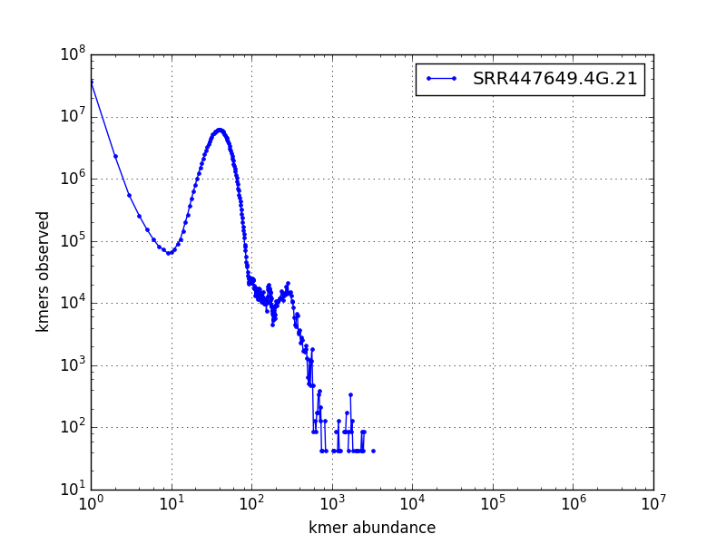
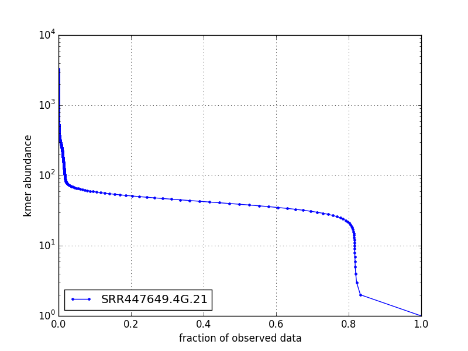
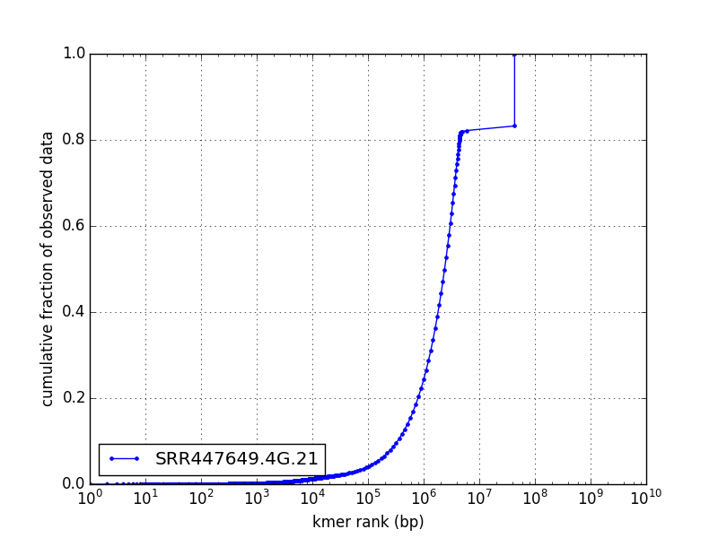
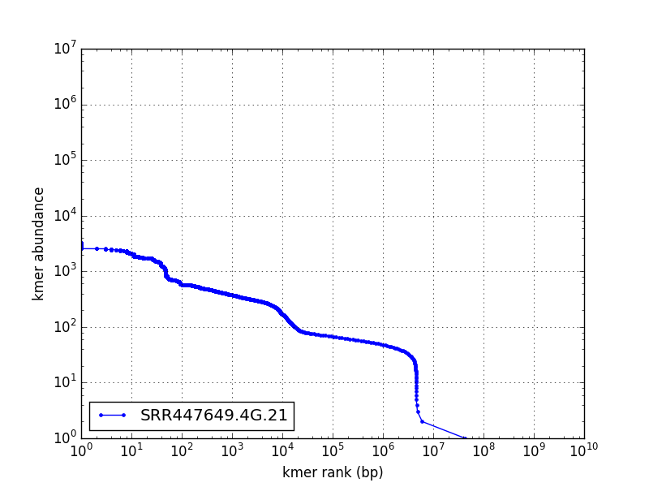
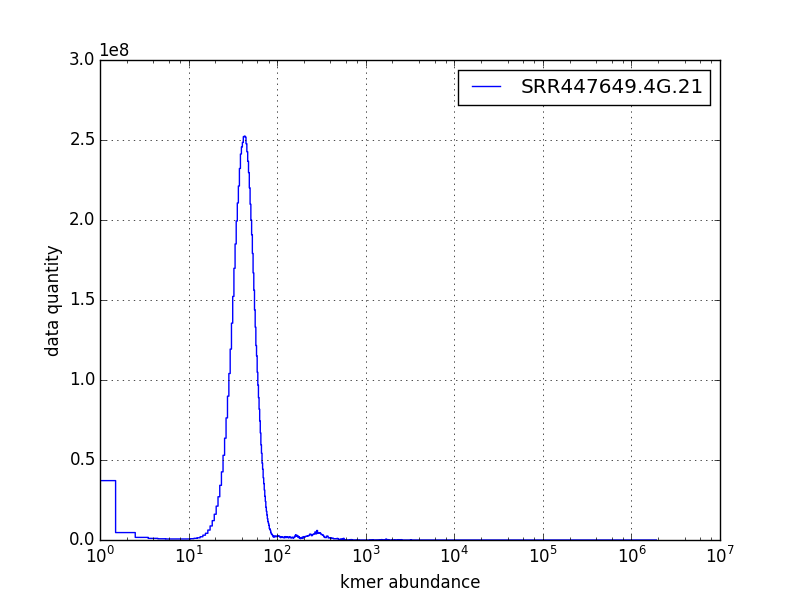

This dataset is typical illumina sequencing, though with a high error rate.

Among the things we can learn from these graphs of the spectrum:
* The dataset has a modal kmer abundance of 22x (corresponding to 24x "real" abundance) 
* A large fraction of the whole dataset (43%) is in unique, "singleton" kmers.  This is 
high for illumina.
* The dataset has modest (2%) levels of adapter contamination--sequences less than 100bp in
length at very high kmer abundances, >10,000x

And, since it just takes a minute, let us count our other two datasets
```bash
load-into-counting.py -x 1e9 -k 21 SRR519926.4G.kh SRR519926.fastq 
abundance-dist.py -s SRR519926.4G.kh  SRR519926.fastq SRR519926.4G.21
load-into-counting.py -x 1e9 -k 21 SRR036919.4G.kh SRR036919.fastq 
abundance-dist.py -s SRR036919.4G.kh  SRR036919.fastq SRR036919.4G.21
```
By this point we should have three `.4G.21` spectrum files.  We can plot them all at once:
```bash
plotkmerspectrum.py *.21 -g 3 
```

And we can plot other (complimentary) visualizations while we're at it:
```bash
for i in 1 3 5 6 20
do 
plotkmerspectrum.py *.21 -g $i 
done
# should generate ERR098008.21.1.pdf ERR098008.21.3.pdf ERR098008.21.5.pdf ERR098008.21.6.pdf and ERR098008.21.20.pdf
```

These first two visualizations tell us that one dataset has very high >10000x abundance and the others are medium 20-60x:

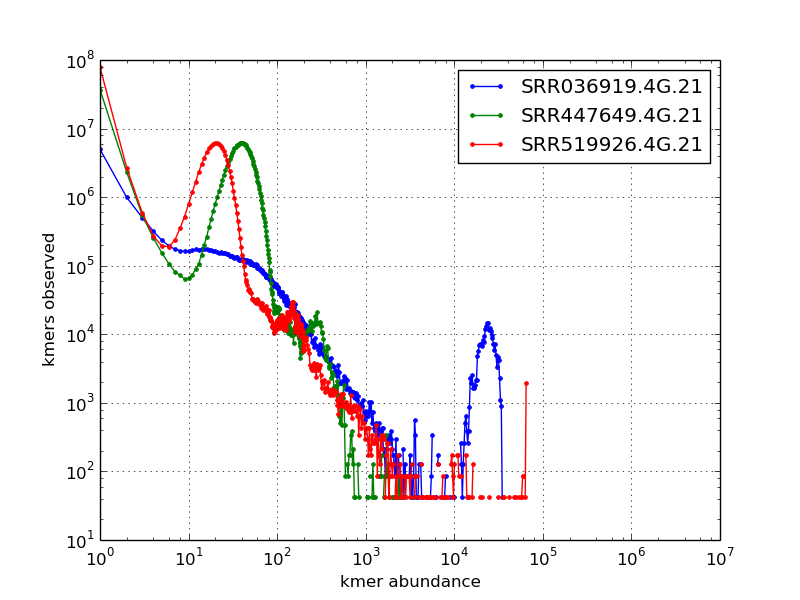
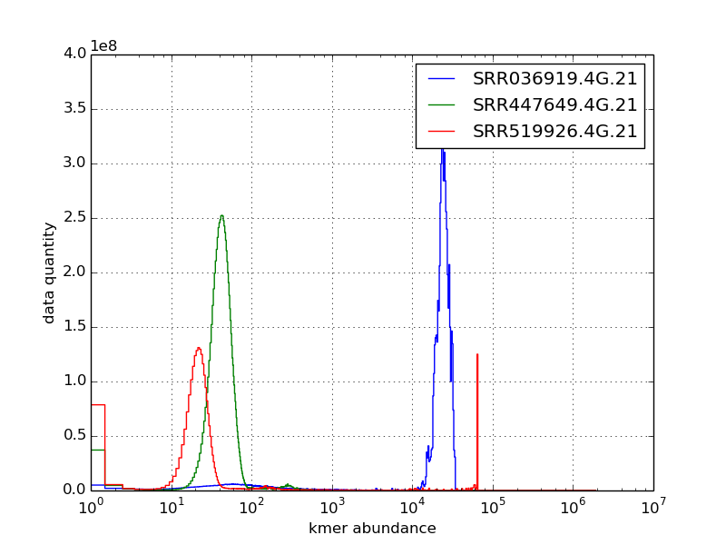
And here we learn that some E. coli datasets are almost half singletons:
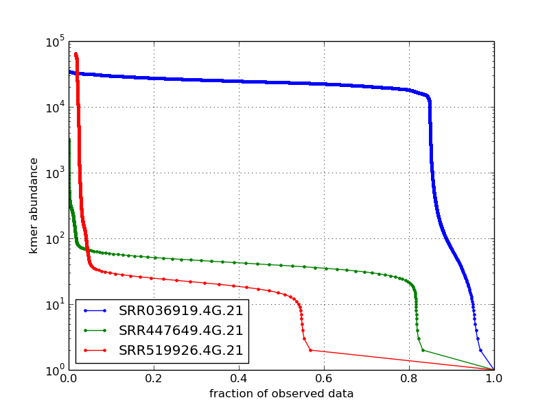

But these two visualizations, using kmer rank, show the difference 
between the low-complexity (6kb) PhiX sequencing and the 5 Mbase E. coli:

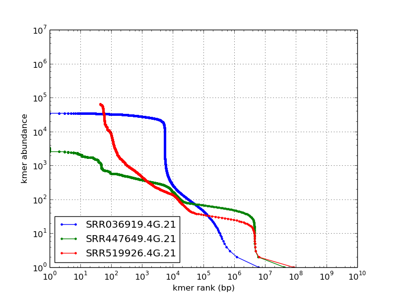
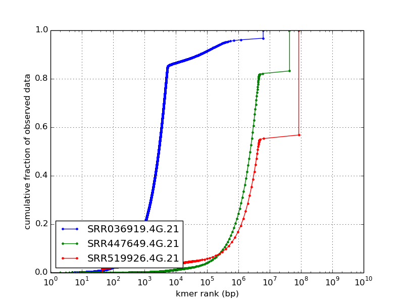

## Before and after kmer visualizations
We can use kmers to describe datasets before and after bioinformatic manipulations.  Here we apply Q-value trimming and adapter scrubbing to one of the example E. coli datasets and examine the results.

### Q-value trimming
The data carpentry 
[cloud genomics class](https://github.com/JasonJWilliamsNY/cloud-genomics/blob/master/lessons/3.single-analysis.md) has a recipe for Q-value trimming using Trimmomatic.

```bash 
mkdir /mnt/SRR519926_trimmed
cd /mnt/SRR519926_trimmed
java -jar $trimmomatic  PE -phred33 -trimlog trimlog.txt \
   ../SRR519926_1.fastq ../SRR519926_2.fastq p1.fq u1.fq p2.fq u2.fq \
   LEADING:5 TRAILING:5 SLIDINGWINDOW:4:20 MINLEN:50 2>&1 | tee cmd.txt
```
This gives us four files for paired and unpaired reads post-trimming p1.fq u1.fq p2.fq u2.fq.

Now let us combine the four output files and count kmers, this time using jellyfish:
```bash
cat p1.fq u1.fq p2.fq u2.fq | countkmer21.sh > SRR519926_trimmed.21
```

```bash
plotkmerspectrum.py SRR519926_trimmed.21 ../SRR519926.4G.21 -g 5
plotkmerspectrum.py SRR519926_trimmed.21 ../SRR519926.4G.21 -g 3
plotkmerspectrum.py SRR519926_trimmed.21 ../SRR519926.4G.21 -g 6
plotkmerspectrum.py SRR519926_trimmed.21 ../SRR519926.4G.21 -g 20
plotkmerspectrum.py SRR519926_trimmed.21 ../SRR519926.4G.21 -g 1
```
These commands do two things; they create pdf graphs comparing the two spectra, 
and a one-line statistical summaries in the file kmers.log.

```bash
# display a handful of summary statistics 
cut -f 1,3,6,13 kmers.log  | column -t
#filename                                     M50        F100      C50
SRR519926.4G.21                               3881732.4  0.022929  14.46
SRR519926_trimmed/SRR519926_trimmed.21        1563522.2  0.045487  16.47
SRR519926_adapterscrub/SRR519926_scrubbed.21  3667382.3  0.000968  15.46
```
Here M50 is the number of kmers to explain half of the (observation-weighed) data,
F100 is the fraction of the data in the top 100 kmers (a proxy for adapter contamination),
and C50 is the depth needed to explain half of the data.

### Before and after plots

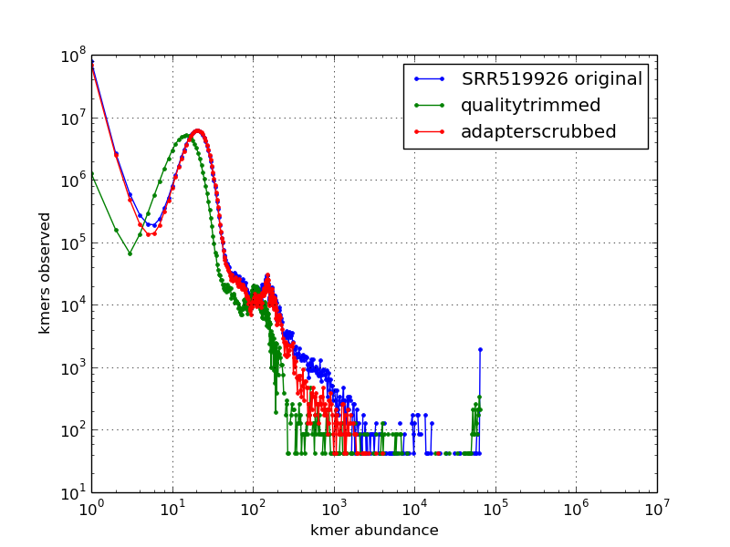
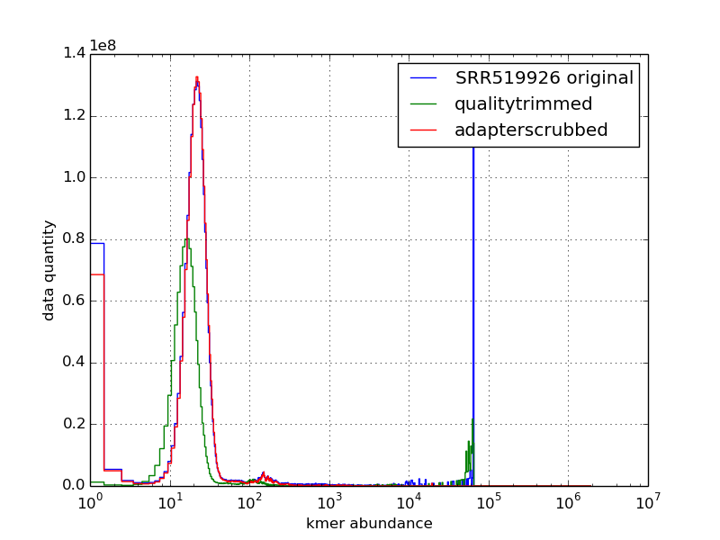
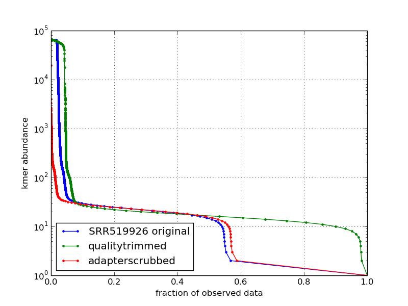
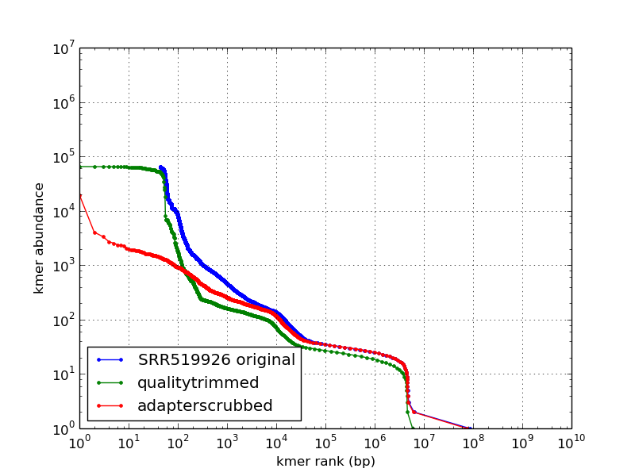
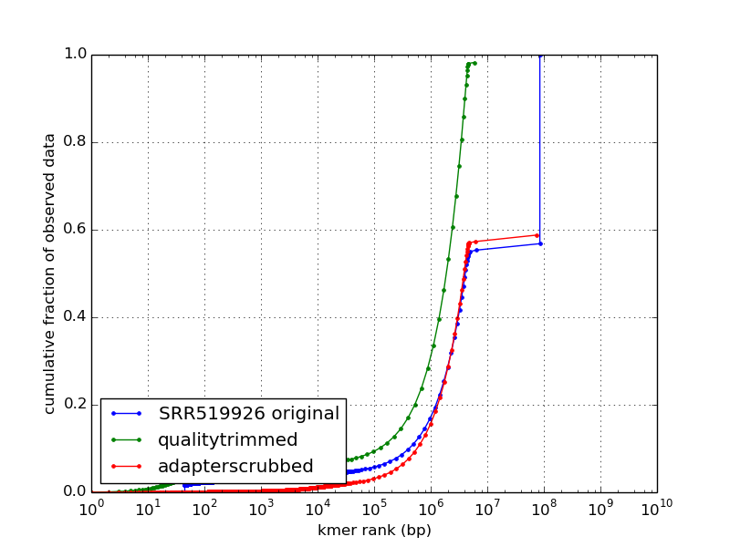

### What do we see?
Now if we compare the kmer spectrum before and after, we find several things:
* The trimming reduced the modal kmer abundance from 22x to 17x -- this is the genome we threw out with trimming.
* The trimming dramatically reduced the number and fraction of singleton observations, from 43% to less than 2% of the surviving data.
* The 2% adapter adapter contamination was not addressed by the above recipe, and the elimiation of the singletons actually drove the adapter fraction up to 4%.

Let us try a different scrubbing recipe, this time to remove the high-abundance contaminating adapters.  First, we need a file with the right contaminating adapters

```bash
cat > ~/adapters.fa <<EOF
>TruSeqUniversalAdapter-P5_R
AGATCGGAAGAGCGTCGTGTAGGGAAAGAGTGTAGATCTCGGTGGTCGCCGTATCATT
>P7_indexing74_R
AGATCGGAAGAGCACACGTCTGAACTCCAGTCACTTAACTCATCTCGTATGCCGTCTTCTGCTTG
EOF
```

And now we use a different functionality in trimmomatic to remove the adapters: ILLUMINACLIP
```bash
mkdir /mnt/SRR519926_adapterscrub
cd /mnt/SRR519926_adapterscrub
java -jar $trimmomatic PE -phred33 -trimlog trimlog.txt \
    ../SRR519926_1.fastq ../SRR519926_2.fastq p1.fq u1.fq p2.fq u2.fq \ 
    ILLUMINACLIP:$HOME/adapters.fa:2:30:10 2>&1 | tee cmd.txt
# and then count the kmers:
cat p1.fq u1.fq p2.fq u2.fq | countkmer21.sh > SRR519926_scrubbed.21
```

Now we have the original, post-quality-filtering, and post-adapter-scrubbing variants of our favorite dataset.
Rather than using just the filenames, we can direct `plotkmerspectrum` to take a set of files with human-readable labels:
```bash
cd /mnt
cat > compare.list <<EOF
SRR519926.4G.21	SRR519926 original
SRR519926_adapterscrub/SRR519926_trimmed.21	qualitytrimmed
SRR519926_adapterscrub/SRR519926_scrubbed.21	adapterscrubbed
EOF
```
```bash
# This produces compare.list.3.pdf
plotkmerspectrum.py -l compare.list -g 3
```

Comparing the effect of this treatment on the kmer spectrum, 
* Adapter scrubbing barely reduced the total depth on the genome.
* Adapter scrubbing only slightly reduced the number and fraction of singleton observations.  This improved our data "quality" by removing spurious concatamers between the adapter and bits of genomic context.

## In conclusion
* Counting long kmers is easy and cheap unless you have Hiseq lanes of soil.
* Kmer spectra readily distinguish low-complexity, deep sequencing from complex, shallow sequencing.
* Spectra provide hints about error rates and error correction parameters
* We can see the effect of treatments from the spectra--adatper removal removed most of the high-abundance junk and some of the errors, while the quality filtering removed most of the errors, none of the adapters, and 20% of the genome.

